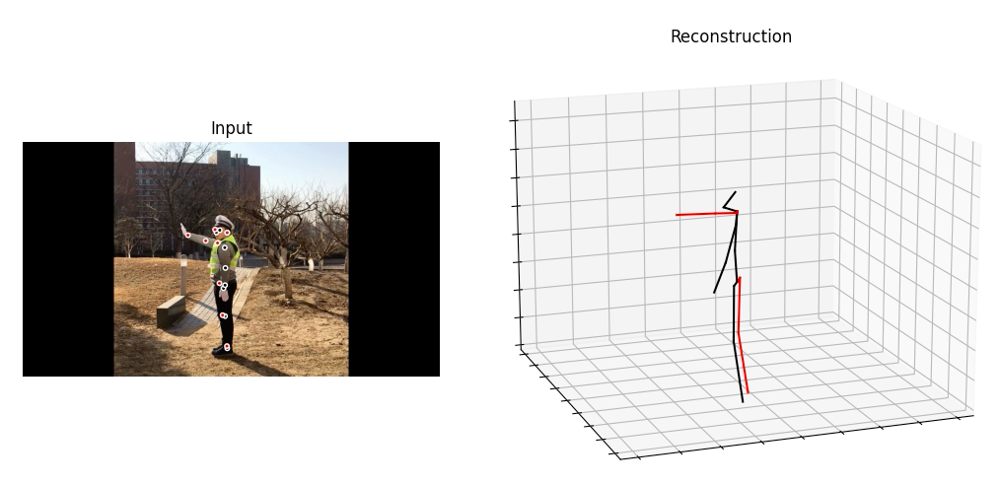

## Final Report-Pose Lifting: 2D to 3D Pose
##### Group Member: Haoran Li, Gang Li, Xiaobei Zhong
----
### **Background**
The pose for a person refers to the position and orientation of keypoints that can describe human body structure. In this field, 2D pose means the pose in a two-dimensional space such as an image, shown in the figure 1. Correspondingly, the 3D pose characterizes the pose in a three-dimensional space (e.g the real world), as shown in the figure 2. Pose Lifting focuses on the algorithm that is able to estimate the 3D pose based on the 2D pose so that the person’s pose can be indicated more accurately and vividly.The project is provided by Huawei Technologies Canada and click [here](https://www.google.com/url?q=https%3A%2F%2Fwww.dropbox.com%2Fs%2Fob68rcrzueabgex%2F3D_Pose_Lifting.pdf%3Fdl%3D0&sa=D&sntz=1&usg=AFQjCNGp51fIt9VQAk86WugxpCW1ptXCUA) to see more information.

### **Work**
Building a computer vision system of 3D human pose estimation from image/video with deep learning methods has drawn enormous attention in the past years. Some systems adopt an end-to-end model that predicts the 3D pose directly from the RGB frames as inputs, and others prefer using a two-stage model, which first calculates 2D pose keypoints and then lifts the detections up to 3D dimensions. We plan to choose the latter way. In our work, the 2D pose estimation can be inferred from a model provided by Facebook, called [Detectron2](https://github.com/facebookresearch/detectron2). The pose lifting model we use is [VideoPose 3D](https://github.com/facebookresearch/VideoPose3D) also provided by Facebook, which can lift 2D pose keypoints up to 3D dimensions. We run this model locally on our pc, then convert it to an applicable format to be deployed on Atlas 200 DK and run them on the board. Our result is as follow		


&nbsp;
## Quick Start
---
### **Dependencies**
Make sure you have the following dependencies installed before proceeding:
- An Atlas 200DK with Matplotlib and Python3.7.5 installed
- Python 3+ distribution
- PyTorch >= 0.4.0
- ffmpeg

### **Atlas 200 DK Connection**
At first, you can access the board by virtual machine or directly by Docker. Tutorial is [here](https://www.notion.so/Atlas-200dk-Setup-332ce3a04f42454bbe3a2949de78f80c#a5bc3c29318340dbaf20e2acaebe4e42)

&nbsp;
### **Dataset Setup**
Get into the folder called VideoPose3D-main and create a directory called input. Put video under the input folder, then go back to VideoPose3D-main
```python
sudo sh 2d_npz.sh videotype ./input/input_videoname
```
videotype can be any type supported by ffmpeg, eg. mov, mp4
This creates a custom dataset named `data_2d_custom_myvideos.npz`

&nbsp;
## Evaluating Model on PC
---
Stay in VideoPose3D-main and run
```python
python run.py -d custom -k myvideos -arc 3,3,3,3,3 -c checkpoint --evaluate pretrained_h36m_detectron_coco.bin --render --viz-subject input_videoname --viz-action custom --viz-camera 0 --viz-video ./input/input_videoname --viz-output output.mp4 --viz-size 6
```
This generate the output video.

&nbsp;
## Evaluating Model on Atlas 200DK
---
### Step 1 Moving Files to Atlast
Move the whole folder called VideoPose3D-main to the board. Make sure the input video is also under ./VideoPose3D-main/input/ directory on the board.

&nbsp;
### Step 2 Running our Model
Get into the folder called VideoPose3D-main and run
```python
Python3 main.py  --input_vid_name input_videoname --output_dir ./output
```
This generate the output video under the output folder.


