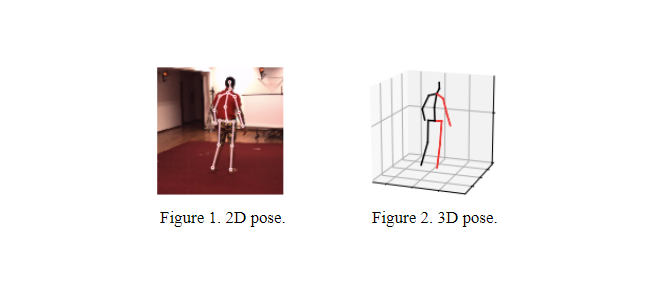

##  VideoPose3D Model on Atlas 200 DK Board: 2D to 3D Pose Lifting
##### Group Member: Haoran Li, Xiaobei Zhong, Gang Li

### **Background**
The pose for a person refers to the position and orientation of keypoints that can describe human body structure. In this field, 2D pose means the pose in a two-dimensional space such as an image, shown in the figure 1. Correspondingly, the 3D pose characterizes the pose in a three-dimensional space (e.g the real world), as shown in the figure 2. Pose Lifting focuses on the algorithm that is able to estimate the 3D pose based on the 2D pose so that the person’s pose can be indicated more accurately and vividly. The project is provided by Huawei Technologies Canada and click [here](https://gainful-track-f3d.notion.site/Atlas-200dk-Setup-332ce3a04f42454bbe3a2949de78f80c) to see more information.



### **Work**
Building a computer vision system of 3D human pose estimation from image/video with deep learning methods has drawn enormous attention in the past years. Some systems adopt an end-to-end model that predicts the 3D pose directly from the RGB frames as inputs, and others prefer using a two-stage model, which first calculates 2D pose keypoints and then lifts the detections up to 3D dimensions. In our project, we chose the latter way. For the model selection, we adopted the [VideoPose3D](https://github.com/facebookresearch/VideoPose3D) model from Meta Research Lab which consists of 2 procedures as mentioned previously. The 2D pose estimation part is called [Detectron2](https://github.com/facebookresearch/detectron2) and the 2D-3D pose lifting model is VideoPose3D which is also provided by Meta. We first ran these models locally on our pc, then converted them to an applicable format to be deployed on Atlas 200 DK and executed them on the board. (For more information about result, please check out the video we generated below).	

[](https://drive.google.com/file/d/1vwMXUKQCJiePlNm7iOe3IkxQE2tHCvge/view?usp=sharing)


### **Time Comparsion**
Based on the right\_turn.mov, we compare the time efficiency of running locally and running on the Atlas 200 DK board:

| Run Locally | Atlas 200 DK |
| ----------- | ----------- |
| 25.513s     | 1.589s      |

The time shown above does not include the time for making visualization. It turns out that the time for vistualization is better when running locally. However, for model prediction, Atlas 200 Dk with NPU is much faster.


&nbsp;
## Quick Start

### **Dependencies and Environment**
The following are the requirments for running the model:
- Linux Ubuntu 18.04 or later version.
- The Atlas 200 DK board with Matplotlib and Python3.7.5 installed
- Python 3.7.5
- PyTorch >= 0.4.0
- ffmpeg

### **Atlas 200 DK Connection**
First, you need to access the Atlas 200 DK board by virtual machine or directly by Docker. Tutorial is [here](https://www.notion.so/Atlas-200dk-Setup-332ce3a04f42454bbe3a2949de78f80c#a5bc3c29318340dbaf20e2acaebe4e42)

&nbsp;
### **Detectron2 Custom Dataset Setup**
Under VideoPose3D\_Atlas200DK directory and make a directory called input. Afterward, move your input video under the input directory, then go back to the parent directory and run the bash script below:
```python
sudo sh 2d_npz.sh [INPUT_VIDEO_FILE_EXTENSION] ./input/[INPUT_VIDEO]
```
[INPUT\_VIDEO\_FILE\_EXTENSION] can be any type supported by ffmpeg, eg. mov, mp4.(**Without dot in the front.**)
Above will create a custom dataset named `data_2d_custom_myvideos.npz`(Make sure this file is under data folder before proceeding to the next step).

&nbsp;
## Evaluating Model Locally

Stay in VideoPose3D\_Atlas200DK directory and run the following command:
```python
python run.py -d custom -k myvideos -arc 3,3,3,3,3 -c checkpoint --evaluate pretrained_h36m_detectron_coco.bin --render --viz-subject [INPUT_VIDEO] --viz-action custom --viz-camera 0 --viz-video ./input/[INPUT_VIDEO] --viz-output output.mp4 --viz-size 6
```
Above line will generate the output video.

&nbsp;
## Evaluating Model on Atlas 200 DK Board

### Step 1 Moving The Repository to The Atlas 200 DK Board
Move the entire VideoPose3D\_Atlas200DK directory to the Atlas 200 DK board. Make sure the input video is also under ./VideoPose3D\_Atlas200DK/input/ directory.

&nbsp;
### Step 2 Evaluating our Offline Model
Under the folder called VideoPose3D\_Atlas200DK and run the following command:
```python
Python3 main.py  --input_vid_name [INPUT_VIDEO] --output_dir ./output
```
Line above will generate the output video under the output folder of current directory.


## Acknowledgement

Current Repository is built on top of [VideoPose3D](https://github.com/facebookresearch/VideoPose3D), and [Detectron2](https://github.com/facebookresearch/detectron2).


